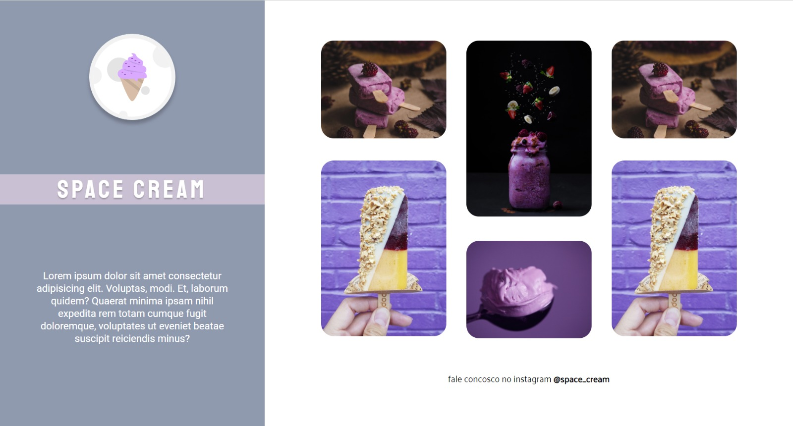

<h1 align="center"> Desafio 05 - Space Cream </h1>

 

  

## Sobre o desafio

Este foi outro desafio do curso da rocketseat.   
Após aprender sobre responsividade, o objetivo era fazer o layout para mobile e depois transformar em reponsivo para desktop, com algumas alterações.  
O maior desafio foi o uso do grid, para alinhar as imagens no layout para desktop.  

## Tecnologias utilizadas

Esse projeto foi desenvolvido com as seguintes tecnologias:

- HTML e CSS
- Git e Github
- Figma